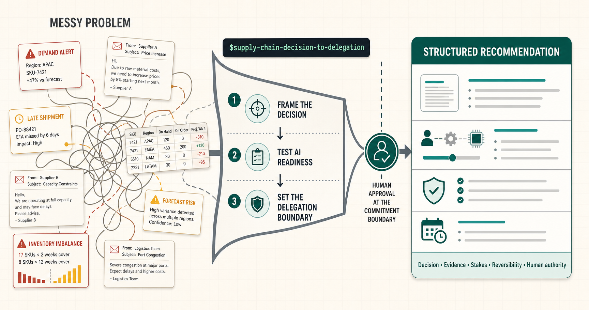
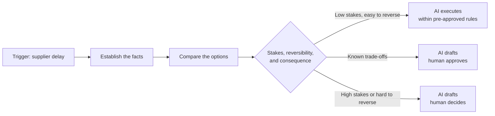

# The 6:12 a.m. supply-chain problem

At 6:12 a.m., a supplier delay lands in a planner's inbox. The signal is clear enough. The work is not. Which customer orders are now exposed? How much inventory remains? Is an alternative supplier viable? Who has the authority to accept higher cost, shift production, or tell a customer?

That is not primarily an AI-agent problem. It is a decision problem: a repeatable operational moment in which evidence sits across systems, ownership is diffuse, and the next action becomes late because the team has to assemble the case before it can make the call.

Before asking an agent to do anything, leaders need to name the decision they are trying to improve. Until they can name it, define the person responsible for it, and describe what is at risk, the exception is only a scramble with a fashionable label.

Most agent conversations skip this diagnosis. They begin with a capability: monitor suppliers, optimise inventory, reroute freight. But the management problem usually comes earlier. The facts that should inform a decision live in different places, their timeliness and credibility are uneven, and nobody has agreed which variance deserves attention first.

The result is not a lack of automation. It is a weak problem statement. A late purchase order, shortage, or shipment delay gets treated as a message to clear rather than a decision to make.

## A skill for the work before the workflow

To make this diagnosis practical, we built the [`supply-chain-decision-to-delegation` skill](../../skills/supply-chain-decision-to-delegation/). It is designed for the work that happens before a team selects an AI agent, designs a workflow, or funds a pilot.

The skill does not fix the supply-chain problem. It helps a leader or planner identify the decision trapped inside it. Starting with one recent exception, it guides the team through the trigger, decision owner, evidence, time window, stakes, reversibility, and consequences. It separates gathering facts from comparing options and from making a commitment that somebody must own.

That distinction allows the skill to recommend one of three delegation boundaries: AI drafts and executes inside pre-approved rules; AI drafts and a human approves; or AI drafts while a human owns the decision. It can also conclude that the use case is not ready for AI because ownership, policy, process, or data must be repaired first.

The output is a scoped problem statement and a structured recommendation—not an automatic technology prescription. Depending on the situation, the skill can produce a decision-to-delegation brief, use-case shortlist, workshop summary, bounded-pilot charter, or not-ready-for-AI report.

Invoke `$supply-chain-decision-to-delegation` with one recent operating event and ask: **what decision is trapped inside this problem, and what—if anything—should be delegated to AI?**

A useful problem statement starts with questions like these:

| Ask this | It reveals |
| --- | --- |
| Which decision repeatedly arrives too late? | The operational problem, not merely its symptom |
| What event triggers the scramble? | The boundary of the workflow |
| Which facts must be assembled before someone can act? | The evidence gap |
| Who can make the consequential decision? | The ownership gap |
| What is at stake if the decision is late or wrong? | The size of the risk |
| What can be reversed, and what cannot? | The decision's reversibility |
| Who carries the commercial, customer, or operational consequence? | The real accountability |

The test changes the question. The same late-supplier alert may contain several kinds of work: collecting facts, comparing options, and accepting consequences. Lumping them together is what makes teams say either “AI can handle it” or “AI cannot be trusted.” Neither is a useful diagnosis.

That distinction is becoming more important as AI agents move from demonstrations into operational settings. Recent supply-chain and agent-governance commentary converges on a simple idea: make authority explicit, limit access to consequential actions, and keep the activity observable. [Supply Chain Management Review](https://www.scmr.com/article/how-agentic-ai-changes-supply-chain-operations/automation) and [IDC](https://www.idc.com/resource-center/blog/agentic-ai-is-critical-infrastructure/) make the same broad case from different angles.

For a planner, that produces three materially different arrangements:

| Arrangement | What AI does | What people retain | Best fit |
| --- | --- | --- | --- |
| **AI drafts and executes within a pre-approved boundary** | Gathers signals, applies a clear rule, and completes a low-risk action | The policy, the boundary, and accountability for the outcome | High-volume work with low stakes that is easy to reverse |
| **Collaborative: AI drafts, human approves** | Assembles evidence and recommends a response | Approval before the action is released | Known choices with meaningful trade-offs |
| **Human-owned: AI drafts, human decides** | Prepares the decision packet and the alternatives | Judgement, the decision, the action, and its consequences | High-stakes, ambiguous, or hard-to-reverse decisions |

Take the 6:12 a.m. alert again. Imagine that a supplier has moved delivery of a critical component from Thursday to Monday. Before anyone can respond, somebody has to establish the facts: the affected purchase-order lines, the quantity and date variance, on-hand and in-transit inventory by location, the production orders that consume the part, the customer commitments downstream, and whether the new date is confirmed or merely an estimate.

Then comes a different kind of work: comparing the possible responses. Can production be resequenced? Is stock available in another warehouse or country? Is a substitute part qualified? Can the supplier expedite a partial shipment? What does each option do to cost, service, quality, and the promises already made to customers?

Finally comes the consequential decision. Paying an expedite premium, reallocating scarce stock from one customer to another, pausing a production line, or changing a delivery promise does more than clear an alert. It changes a commercial or operational commitment. All of this is often labelled “the supplier exception,” but it is a chain of distinct decisions with different evidence, stakes, reversibility, and owners. Until those differences are visible, asking whether AI should manage the exception is a category error.

> [!NOTE]
> **Frame the problem before choosing the agent**
>
> When **[trigger]** happens, **[decision owner]** needs to decide **[specific decision]** within **[time window]**. They need **[evidence]** to assess **[stake]**. A wrong or late decision affects **[customer, commercial, or operational consequence]** and is **[reversible / hard to reverse]**.
>
> Only then define what AI may prepare, recommend, or execute, and what remains human-owned.

## The delegation map

Once the decision is framed, the workflow becomes easier to see. The aim is not to give every stage to AI. It is to make the handoff and the authority boundary visible.

## When the framing becomes the work

Doing this properly takes time. A leader has to reconstruct a real event, find the decision hidden inside the noise, trace the evidence, identify who can accept the consequence, and decide what must remain human-owned. That is exactly why teams under pressure are tempted to jump from a broad pain point to an agent demo.

The work can become tedious, especially when the people framing the problem are also running the operation. So, help us help you.

Use the [`supply-chain-decision-to-delegation` skill](../../skills/supply-chain-decision-to-delegation/) to:

- turn a broad symptom into a specific, owned decision;
- separate fact-finding, option comparison, and consequential commitment;
- make stakes, reversibility, and customer, commercial, or operational consequences explicit;
- test whether the use case is ready for AI;
- choose between bounded execution, human approval, and a human-owned decision;
- produce a decision-to-delegation brief, use-case shortlist, workshop summary, or not-ready report.

Bring one recent exception, not a polished AI brief. The skill will guide the interview, challenge vague assumptions, expose missing ownership or data, and help identify the smallest useful use case. It may recommend a bounded pilot. It may also conclude that process, governance, or data needs attention first. Both are valuable outcomes.

Your first AI-agent use case should not be “supplier management” or “inventory optimisation.” It should be a specific decision that arrives too late, requires too much evidence stitching, and has clear limits on what can be delegated.

So ask your team: what is the biggest supply-chain problem we keep discovering too late? Then ask the harder question: what exact decision is trapped inside it?
